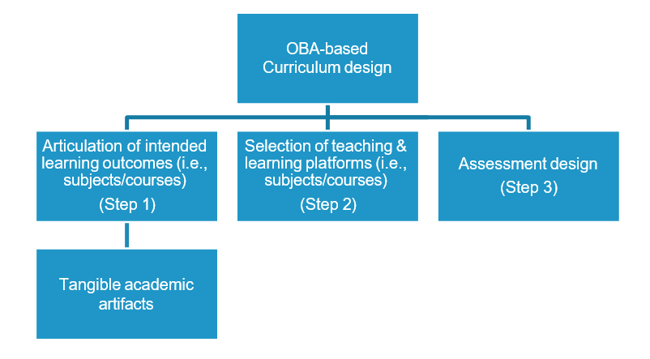
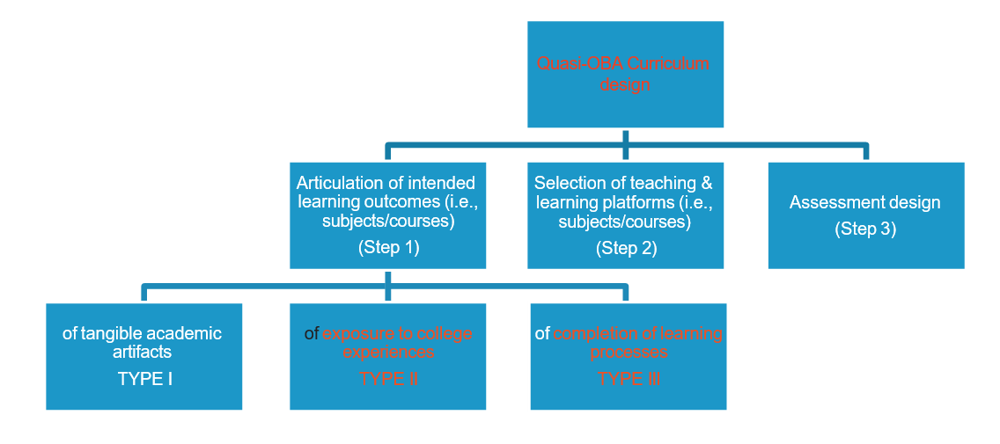

CHAPTER 3

Quality Assurance in Hong Kong: Fit for Cultural Perception
===================================================================

Jianrong Sun

Macau University of Science and Technology,Taipa, Macau (SAR), China

**3.1 INTRODUCTION**

Responses to increasing public accountability and the expectations of continuous improvement have served as two1 of the major impetuses for evaluating quality in higher education in recent years, focusing more on the assessment of student learning outcomes (Gaston, 2014). Such a shift in evaluation emphasis for student learning centrality is found in the Criteria for Accreditation for U.S. institutional accreditation (Ewell, 2006a; Gaston, 2014; HLC/NCA, 2010), in the Standards of Evaluation for undergraduate teaching endorsed by the Ministry of Education, China, and in the quality audit conducted by the Quality Assurance Council (QAC) of the University Grants Council (UGC) of all UGC-funded institutions (QAC Audit, 2008) in Hong Kong. In each quality assurance approach, the student learning–centered emphasis is articulated to differ- ent extent in their respective evaluation standards, providing guidance for how institutions are evaluated in this aspect. Such differing descriptions of how learning centrality is understood and defined for evaluating quality in teaching reflect the cultural influences, among other variables, where edu- cation is rooted. The impact from those criteria and standards on higher education is two-fold: the quality of education is reexamined in terms of student learning outcomes demonstrated in their performance (i.e., what students can do with what they have learned), and institutional improve- ment is expected in terms of institutional effectiveness, as is reflected in curriculum reemphasis on student learning (Ewell, 2006a).

A case analysis of the recent transformation (“3+3+4”) in the higher education sector in Hong Kong is provided to support suggestions to be made on how to meet challenges that occur with QA practices within the college curriculum design and implementation.

**3.2 QUALITY ASSURANCE IN THE SPECIAL**

ADMINISTRATIVE REGION (SAR) OF HONG KONG
As a Special Administrative Region of the mainland China, Hong Kong enjoys a high degree of autonomy in terms of governmental responsibili- ties2 for many areas. There are eight UGC3-funded institutions of higher education with an enrollment of 97,585 students (including 6076 enrolled in subdegree programs and 10,593 in post-graduate programs) of 2014– 2015 academic year (Statistics of HK higher education, 2015). In addition to the eight UGC-funded institutions, there are also nine private institu- tions of higher education, and some 19 other institutions of higher educa- tion (public, and subdegree, not of a university status). Quality assurance could be described as two general domains: institutional QA and pro- grammatic QA. The former is then divided into two types: QA provided by the Quality Assurance Council (QAC) for eight UGC-funded insti- tutions, and the Hong Kong Council for Accreditation of Academic and Vocational Qualifications (HKCAAVQ) for private and vocational insti- tutions. Hong Kong Institution of Engineers (HKIE), a signatory of the Washington Accord, provides programmatic accreditation for engineers.
The Quality Framework in Hong Kong is “a seven-level hierarchy of qualifications covering the academic, vocational and continuing education in Hong Kong. The framework is broadly comparable to qualifications frameworks in other countries, with levels five to seven covering first and higher degrees”. QA practice in the higher education sector in Hong Kong can trace its historical development of relatively strong ties with the UK’s higher education. The current QA infrastructure, concepts, framework, as well as practices, all bear similarities with those used in the UK higher education sector. The generic QA system follows a hierarchical structure where QA framework and structure is found at institutional level as well as program level (QAC Audit Manual, 2014), summarized in the following table:

===========  ================================  ==================================
            Structure                         Processes
===========  ================================  ==================================
Program      - Departmental Assessment         - Annual QA Reports
             - Departmental Academic           - Reports on Departmental
               Advisor System                    Performance
             - Program Advisory                - Annual Business Plans
               Committee                       - Course Review & Annual
                                                 Progress Report
                                               - Program Reviews & Reports

Institution  - Institutional Assessment        - Annual QA Reports
             - Institutional Academic          - Annual Business Plans
               Advisor System                  - Guidelines and Regulations
                                                 for Program Planning,
                                                 Validation and Management
===========  ================================  ==================================

QA bodies in the form of committees are found at both institutional and program levels and they oversee all QA-related issues: subject and pro- gram matters are discussed and acted upon through program level QA bodies; program issues are discussed first at the program level before going through institutional level QA processes for final decision making. The QA processes follow the same procedure: subject level QA information is sent to the program, and the program QA information is sent to the insti- tution for reporting purposes.
With such generic QA systems in place, academic-related issues for discussions, clarification, and/or decision making routinely identify a channel through which they seek solutions. Those QA mechanisms, all articulated in a QA handbook, intend to ensure processes and procedures to be observed when expected, and to ensure an oversight of all activi- ties of a department that acknowledges its inter-relationship, ongoing external input, and the individual department’s responsibility for setting its own objectives and assessing progress. An important purpose of QA is for quality improvement. Those QA processes prove crucial. For instance, continuous quality improvement of the department is ensured through the Annual QA Report and Annual Business Plan exercises. While the Annual QA Report provides detailed information concerning the various aspects of the department and provides a self-evaluation of its own performance during the year, the Business Plan outlines the department’s strategy for the foreseeable future. The Departmental Assessment exercise intends to provide a longer-term review and assessment for the purpose of assessing the department’s performance versus its mission and strategic objectives in light of the changing needs of the community, the region, and the world.

**3.3 EXTERNAL QUALITY ASSURANCE INITIATIVES**

The eight UGC-funded institutions of higher education receive peri- odical quality reviews from UGC and later, from the Quality Assurance Council (QAC), which was established in 2007 and is responsible for per- forming a quality audit on all UGC-funded institutions. A brief account of such quality reviews historically reveals several milestones of such qual- ity review exercises: Teaching and Learning Quality Process Reviews (TLQPRs) in 1995–97, and in 2002–3, respectively, and the Performance and Role-related Funding Scheme (PRFS) exercise in 2004, all conducted by UGC. Each round of the three quality review processes focuses on dif- ferent themes, evaluating the health of higher education and providing valuable information for the most recent quality review process conducted by QAC (Ewell, 2006b).

**3.4 THE 3+3+4 TRANSFORMATION AND OBA**

A milestone development in QA occurred in 2003 when UGC made the decision to request its eight funded institutions of higher education to consider OBA to teaching and learning in their curriculum redesign as part of the 3+3+4 transformation of the educational matriculation (three years of junior schooling, three years of high schooling, and four years of undergraduate studies in universities). To facilitate this change, QAC incorporated in its Quality Audit the assessment of the implementation of OBA as an important component to examine:
… whether an institution has quality assurance processes in place appropriate for its stated purposes, whether it pursues activities and applies resources to achieve those purposes, and whether there is verifiable evidence to show that the pur- poses are being achieved. The QAC’s Audit Manual sets out how the QAC conducts audits and what it expects to receive from institutions” (QAC Audit Manual, 2008, p. 21).

During the period of 2004–2008, all the eight UQC-funded institu- tions invested both manpower and energy, revising each of their curricu- lums within the OBA framework, with particular attention given to the shift of focus from teaching to student learning. The institutional audit conducted by QAC made it clear in its Focus Area of the QAC Audit Manual that the quality of student learning as the centerpiece is embed- ded in several of the 11 Focus Areas for the audit. Those Focus Areas examine various processes and infrastructure in terms of how “the insti- tution’s practices in each focus area contribute to student learning out- comes” (QAC Audit Manual, 2008, p. 48). In addition to the evidence to be provided by the institution under audit, the institution is expected to make external reference points and outcome measures to give “added assurance that the outcomes have been specified and measured appropri- ately” (QAC Audit Manual, 2008, p. 54).

**3.5 APPROACHES TO AUDIT IN HONG KONG**

An audit in the Hong Kong context asks how well students achieve these intended learning outcomes defined by each institution and its programs. In a way, the definition of what student learning comprises is left to each institution to provide evidence for students’ achievement of those learn- ing outcomes. The audit is now taking an approach similar in assessment methodology, but different in assessment substance. Currently, course- based student evaluation information still comprises the major portion of student learning evidence. In other words, student course grades provide a larger portion of student learning outcome achievement. At the pro- gram level and institutional level, use of assessment methods to collect stu- dent learning information is sporadic and this could be justified in that Hong Kong institutions follow a stringent internal quality assurance sys- tem aforementioned, often called the Department Assessor (DA), which requires both internal and external checks on course level evaluation design and results. Such checks assure the quality of course-based exam- inations and tests, which is the dominant course evaluation mechanism. Use of external assessment tools is not yet systemized (programs that have external accreditation tend to have more of such external assessment activ- ities than programs that do not have such external accreditation). Such evaluation is so noted during the audit process, which critically examines the internal quality assurance structure, how effectively it works, and takes samples horizontally/vertically of an institution to evaluate its quality.

As the term “audit” suggests, the audit process in Hong Kong displays the expected characteristics of an audit in that it is a process of verifi- cation against a set of standards, as is clearly described in the Overview of the audit: “the purpose of the Audit is to allow the panel to test the material presented by the institution through first-hand investigation and personal interactions.” (QAC Audit Manual, 2008, p. 32). The logistics and arrangement for the audit visit reflect such characteristics: interviews and meetings with various (pre-requested) groups of individuals typify the pri- mary site visit activities. The Audit Timetable engages an institution nine months prior to the site visit, with follow-up activities between the insti- tution and the QAC for the next 22 months. The extent to which mem- bers of an institution are involved in the audit preparation process is fairly limited to a core of individuals with direct supervision responsibilities. A common approach in an institution’s preparation process is to form a spe- cial committee that is given the responsibilities to direct the preparation process (such as information gathering and analysis, conducting internal meetings, and drafting the institutional submission report). Comparatively speaking, campus-wide involvement is limited only to a small core of administrative people, and the majority of the campus community are less actively involved or engaged. To facilitate the audit process, a panel comprising individuals from both inside and outside of Hong Kong is formed from a relatively small pool of the QAC’s Register of Auditors. These auditors have undertaken training on how to perform audit visits. A characteristic of those auditors is their seniority largely by position held in their respectively institutions (other than the lay persons from outside higher education). Some of the panel members are invited from overseas institutions, and normally, no faculty members are included in the panel.

**3.6 IMPACTS OF QUALITY ASSURANCE ON THE ACADEMIA**

As a profession, higher education institutions attempt to enhance their educational services as well as its management effectiveness through qual- ity assurance. The adoption of quality assurance approaches would insert impacts on the community of the academy. The intended impacts can bring benefits to institutions; however, they could also pose challenges. An analysis of such impacts is provided below from an examination of the QA criteria in practice in Hong Kong. Reasons for what education quality is to be expected and how it is to be assessed will be discussed below.

**3.7 COMMONLY ACCEPTED EDUCATIONAL PRACTICES AS EXPECTED IN QA CRITERIA**

For the Institutional Audit by QAC in Hong Kong, the criteria used con- stitutes a crucial component for the QA processes. They are used not only to guide the QA processes by those directly involved during the site visits, namely, Audit Panel members in Hong Kong, but also to heavily influence participating higher education institutions in their QA reports preparation (i.e., institutional submission in Hong Kong) and some of the substantial changes in their academic practices. Key features in the QA criteria manifest themselves in three aspects:
(1) articulation of expectations for student learning outcomes, (2) expecta- tions of continuous improvement from institutions, and (3) implementa- tion of the evaluation processes.

**3.8 A FOCUS ON STUDENT LEARNING OUTCOMES**

In Hong Kong, quality assurance has been in existence for some time, but recent changes in its quality assurance approach have made student learn- ing outcomes a central focus. The adoption of OBA in curriculum rede- sign for all the eight UGC-funded institutions in 2006 during the 3+3+4 changes demonstrates the desire to further enhance educational quality. The first round of institutional audit (2007–11) places a special emphasis on assessing students’ achievement of those articulated learning outcomes. The commonality in the language used to describe student learning focuses on student performance, competence, and abilities, as illustrated in their achievement of those articulated learning outcomes.

**3.9 EXPECTATION OF CONTINUOUS IMPROVEMENT**

In the first round of an institutional audit in Hong Kong, improvement expectation was articulated in every one of the eleven Focus Areas (stan- dards). Institutions were asked to address questions of how their current pro- cesses lead to improvement, how evidence from student learning assessments were used to make improvement plans, and how resources were allocated to facilitate improvement. In terms of monitoring progress, each institution was required to report progress on recommendations. During the second round of audit (2012–15), a focus was added on quality enhancement:
… defined in terms of institutional policies, procedures, and activities that are designed to promote the learning experience and learning outcomes of students and also contribute to the enrichment of the curriculum (QAC Audit Manual, 2014, p. 8).

The two rounds of audit conducted by QAC have their specific focus area; the first round assured that the followings were in place in institutions:
… effective quality assurance systems for the maintenance of provision at the level of programs and faculties, and institutional oversight of the academic standards of higher education qualifications. The next cycle offers the opportunity to build on this established base to take forward priorities for quality enhance- ment and sector-wide development” (QAC Audit Manual, 2014, p. 12).

**3.10    EVALUATION PROCESSES**

Among all components of the evaluation processes are the self-study pro- cess and the on-site visit process. The completion of the self-study pro- cess provides an institution with an opportunity to engage its community members, faculty as well as administrative staff, along with students, to critically examine its system, policies, processes, procedures, and results against the quality assurance standards/criteria, and summarize its findings from such reflections into a document (“self-study” as is called in the US accreditation, “self-evaluation report” as is referred to in the China evalu- ation, and “institutional submission” in the Hong Kong audit) to be sub- mitted as part of the institution’s supportive evidence.
When the three elements from the QA approaches are summarized together, they all point to a theme: that student learning as the core oper- ational area of a higher education institution provides an impetus for institutional continuous improvement and verification of resultant accom- plishment is needed to assure interested stakeholder groups of the validity of implementing such quality assurance processes.

**3.11    CULTURALLY-IMPACTED QA CRITERIA**

Each quality assurance approach is deeply embedded in the culture which nurtures, impacts, and is served by the educational system (Sun, 2011b). Among Hofstede’s (2001) six dimensions used to analyze characteris- tics of national cultures, several of the dimensions (i.e., Power Distance, Uncertainty Avoidance, Aggressiveness, and Collectivism) have high asso- ciations with the characteristics identified as unique to educational prac- tice and behaviors in Hong Kong. Without doubt, differences will occur in those quality assurance approaches, which makes each one unique in itself as compared with others.

**3.12    QUALITY OF STUDENT LEARNING DEFINED: HONG KONG**

In a recent UGC report (UGC, 2010), three elements were identified for the enhancement of higher education in Hong Kong: effective utilization of limited resources for quality education services, competition with international peers during the globalization of higher education, and main- taining relevancy in providing quality assurance for Hong Kong higher education.
Hong Kong has made tremendous progress in its higher education sec- tor. Learning from both the quality assurance models from the UK and Australia, Hong Kong higher education has benefited greatly in devel- oping and designing its own quality assurance model for use. The most direct impetus for the current QAC Audit is “the expansion of the post- secondary section” (QAC Audit Manual, 2008, p. 5) in Hong Kong, and the UGC-funded institutions “are playing an increasingly active role in the provision of higher education opportunities” (QAC Audit Manual, 2008,p.5). Like in many other countries, education is a strong public good, and the public is increasingly expressing its interest in quality issues for those educational programs offered in universities. The recent transformation of the higher education system to move to a 3+3+4 structure4 provides a good platform for the current audit process.
With the audit model used for the evaluation, the Hong Kong higher education system quality assurance processes also display cultural impact. Two areas stand out: seniority plays an important role in who to involve in the quality assurance processes, and authority of responsibil- ity within the hierarchical positions influences degree of participation in and contribution to quality assurance on campus. Hong Kong’s long local tradition culture contains a unique mixture of both Chinese culture and those from other cultures. In the academic community on campuses, there is a heavy presence of seniority that impacts academic life. As the audit model emphasizes performance and behaviors against a set of standards during evaluation, a strong cultural belief of seniority representing power and the right to make such evaluative statements and conclusions results in fewer people with such seniority being involved directly in the qual- ity assurance processes. Strong internal quality assurance systems currently found in Hong Kong higher education institutions, although a very ben- eficial component for internal quality assurance, reinforce the authoritative division of responsibilities under which members act accordingly in their performance. 

**3.13    QA OUTREACH AND ITS IMPACT**

Hong Kong has a relatively long history and experience in its QA out- reach with peer international QA bodies. Two such QA organizations, for instance, are the HKIE as a signatory of the Washington Accord, and the HKCAAVQ as a founding member of the International Network for Quality Assurance Agencies in Higher Education (INQAAHE) and the Asia–Pacific Quality Network (APQN). Such QA outreach at the inter- national level is found at two forms: (1) government initiated collabora- tion with QA organizations with other countries and international QA bodies, and (2) participation by programs to seek specialized accreditation.
Those outreach efforts have provided useful platforms for QA organiza- tions to (1) benefit from sharing with peer QA professionals from outside of Hong Kong on best practices in QA and enhancing awareness of and recog- nition by peer QA bodies of how QA is conducted in Hong Kong, (2) gain first-hand experience from such accreditation processes in seeking peer rec- ognition of program quality and in aligning its own QA work with profes- sionally recognized practices and benchmarks, and (3) improve QA practices.

**3.14    MODIFICATION IN OBA: A CASE ANALYSIS**

Continuous improvement characterizes current QA practices in higher education, as has been discussed so far. Such improvement aims to enhance educational services provided both as a public good and as a manifestation of academic integrity held essential by the academia. The following provides a discussion of how OBA, as an approach to curricu- lum design, could be modified for improvement.
An outcomes-based approach (OBA) to teaching and learning expects a “clear articulation of learning outcomes,” against which student learning is assessed. However, educators who wish to use this OBA framework are confronted with two challenges: that many of the higher order knowl- edge and/or skills (HO-KSs) as defined in Bloom’s taxonomy (Bloom & Krothwohl, 1956) that higher education aspires to instill in students are difficult to articulate in terms of tangible outcomes, and that those intan- gible outcomes pose more difficulties for assessment design (i.e., what would be acceptable outcomes for an intended learning outcome of “lifelong learning”?). The proposed modification of the OBA framework would attempt to maintain its core feature of constructive alignment but modify its execution during the curriculum design process with a focus on (1) articulation of the tangibility aspect of HO-KSs, (2) provision and creation of a student-centered and activity-oriented learning platform, and (3) learning-based assessment design. It is hoped that this quasi-OBA framework would enhance the execution and implementation of the orig- inal intention of the OBA approach (Sun, 2011a, 2011b).

**3.15    A QUASI-OBA MODEL**

Academic curriculum normally consists of two broad categories: disciplin- ary knowledge and skills and meta-knowledge and meta-skills. The lat- ter category tends to include more HO-KSs. College education attempts to emphasize both, requiring students to master a set of facts, rules, and procedures in a discipline, and also expecting students to develop a way of thinking about and making sense of the world (Gregg & Underwood- Gregg, 2011). It is the latter category that posts challenges both concep- tually (how to articulate such expectations as educational outcomes) and technically (how to “teach” and assess them) to curriculum design, imple- mentation, and assessment design, and that tends to outnumber the former category, percentage-wise, in the total number of program intended learn- ing outcomes (Sun, 2010, 2011a).
In an OBA-based curriculum design, a linear process is followed in the initial curriculum design: intended learning outcomes are articulated first, followed by selection of teaching and learning platforms (individual sub- jects and teaching and learning activities) that contribute directly or indi- rectly to students’ achievement of those intended learning outcomes, and finally by assessment design:

**3.15.1 Protocol of an OBA-Based Curriculum Design**

   Figure 3.1 Protocol of an OBA-Based Curriculum Design

The assumption for such a design, that an assessment needs to consist of tangible artifacts from students to indicate the achievement of intended learning outcomes, however, is challenged when reflecting on what a col- lege education entails. An examination of the composition of college edu- cation reveals three aspects: exposures to various learning opportunities (college experiences), completion of designed learning activities (learning processes), and end products produced by students for course-based assign- ments as a result of their experiences and processes (academic artifacts).
During their stay in college, students are exposed to a variety of opportunities (public lectures and forums, extra-curricular activities, on- and off-campus involvement in organized and/or self-initiated activities or community work) through which they learn to understand others and themselves, learn to make sense of events of different nature, and learn to make connections between what they see outside of class and what they learn in the classroom. Such college experiences become essential in enriching and enhancing the education that they receive. By academic tra- dition, all students are expected to complete a set of academic activities (a curriculum for a discipline, required practicum, supplementary extra- curricular activities, evaluation of learning), which would be recorded and evaluated in terms of credits and eventually lead to an academic degree awarded by a discipline.

**3.16    QUASI-OBA DESIGN**

In expecting students to acquire disciplinary knowledge, faculty members include in their program curriculum learning outcomes, many of whose end products are more tangible to be assessed than other outcomes. Those other learning outcomes whose end products are less tangible, however, tend to be of HO-KSs, and the tendency is to either not assess them at all, or assess them indirectly (through surveys and questionnaires). In order to strengthen the assessment of a complete college education that students receive, an OBA-based curriculum needs to decide on a balanced inclu- sion of intended learning outcomes for all three aforementioned composi- tions. For an OBA-based curriculum, the assessability (in terms of the use of direct assessment methods) of those HO-KSs can be enhanced when the assessment focus is shifted from assessing their end products to also include the processes and experiences through which the end product is achieved. With this shift in assessment design, those processes and experiences can be considered to be included as part of intended learning outcomes. 
Not attempting to alter the whole OBA approach, the proposed modi- fication focuses on an expanded array of the learning outcomes of those HO-KSs in terms of the processes through which the eventual realization of such meta-knowledge and meta-skills can be enhanced:

**3.16.1  Proposed Quasi-OBA-Based Curriculum Design**

   Figure 3.2 Proposed Quasi-OBA-Based Curriculum Design

In this modified design, three types of intended learning outcomes would be included representing both LO-KSs and HO-KSs, with tangible outcomes for assessment. In other words, many of the HO-KSs would be embedded in TYPE II and TYPE III learning outcomes, and their out- comes can now be “tangible-lized” for assessment purposes through artic- ulations of process- and experience-based learning outcomes that can be included in an OBA-based curriculum.
Two issues would need to be carefully considered in developing those program learning outcomes: the first one is type (of HO-KSs), and the second one is amount (including those process- and experience-based learning outcomes to maintain a balance in the whole curriculum). The proportion of each type could be determined by the nature of the aca- demic program and other considerations. A specialized program, for instance, may tend to include more LO-KSs as learning outcomes, while a program comprehensive in nature may elect to include more HO-KSs in its intended learning outcomes. Different disciplinary fields emphasize competencies characterized by disciplinary features/aspects, and those fea- tures need to be considered in determining the types. For instance, engi- neering programs expect their students to apply disciplinary knowledge in completing designs or analyzing problems and identifying solutions. In so doing, students will need to be able to develop their abilities in many of the HO-KSs, for example, to identify a potential problem from a mass of given events/information through the use of an appropriate analysis method to analyze and synthesize the given information, before finally selecting a solution after an evaluation of a number of potential solutions.
To reach a consensus for determining the types of HO-KSs deemed important for the students to develop, faculty members would need to collect inputs from various concerned stakeholder groups, and feed the inputs into their decision making processes. In addition, faculty mem- bers also need to consider how such inclusion of those HO-KSs would enhance the overall balance in the total number of intended learning out- comes, and that sufficient number of end-product outcomes and desirable number of process- or experience-oriented outcomes would be main- tained. In special circumstances, external expectations may significantly impact such inclusions. For instance, many ABET accredited programs would have a higher percentage of learning outcomes that are nondisci- plinary and of intangible end products.

**3.17    CONCLUSIONS**

Sharing what works in QA with peers from other regions and countries is not only about the acceptance of educational resources, processes and out- puts, but also for gaining peers’ recognition of the effectiveness and quality of own QA practice. The description of QA practices of higher education in Hong Kong provides a general picture for peers from outside of the region to better understand the QA situations. While QA in Hong Kong has matured more in its design and implementation, there is still room for improvement in its QA design and implementation.
Despite the significant progress made so far in the higher education sector, the UGC is fully aware of challenges confronting the academia in this competitive world driven by globalization. Over the past ten years, UGC conducted studies and invited consultations on strategies for con- tinuous enhancement for the whole higher education sector. A series of recommendations were raised (UGC, 2010) for supporting the enhance- ment. In the area of QA, some caution may be worthy of consideration.
One recommendation (UGC, 2010), that a single QA body instead of the current three QA bodies be created to oversee quality in educa- tion services offered by different education providers or through different channels (i.e., lifelong learning), would be worthwhile for reconsidera- tion. As a high-stakes enterprise, the proposal, although culturally fit, may too narrowly center the power of QA check onto one single entity. There needs to be a careful balance between cultural influence in own QA approach and accepted practices of diverse QA approaches.
A second area for consideration is an increase of nonlocal student intake for the Hong Kong higher education sector. The portion of inter- national students weighs heavily on internationalization efforts.The capac- ity to host this group in Hong Kong is severely limited by the current size of campuses. With the historical position as a gateway between the East and the West, frequent reference has been made “to the desirability of making Hong Kong an ‘education hub’” (UGC, 2010). The current stance taken by UGC seems to strategize such a notion with its efforts to enhance its global competitiveness so that the expected economic invest- ment as well as its strategies to utilize the increasing important platforms generated by the fast-growing economic power by mainland China. Such strategic consideration for internationalization for Hong Kong’s higher education will without doubt affect how quality assurance will shape its future capacity development. A 26 percent increase during a four-year span (2010/11–2013/14) in incoming exchange students as part of the internationalization for Hong Kong’s higher education will pose a chal- lenge, as quality assurance for student learning outcomes for this portion of nonlocal students has to be integrated into the current QA practice.
The last area for consideration is with the implementation of the newly revised OBA-based curriculum in Hong Kong’s higher education sector. 2016 will see the first cohort of graduates from the 3+3+4 curriculum. Adjustments would need to be made to the curriculum from evidence obtained from assessment of student learning outcomes as well as other areas affected within the infrastructure. Judgment on how fit the OBA approach that underpins the new curriculum is could pose a challenge.

**REFERENCES**

ABET, (2008). Accreditation Standards. Accreditation Board for Engineering and Technology (ABET).

Bloom, B. S., & Krothwohl, D. R. (1956).Taxonomy of educational objectives:The classifica- tion of educational goals, by a committee of college and university examiners: Handbook 1: Cognitive domain. New York: Longmans.

Ewell, P. (2006a).Applying learning outcomes concepts to higher education:An overview: A report prepared for the Hong Kong University Grants Committee. National Center for Higher Education Management Systems (NCHEMS).

Ewell, P. (2006b). Applying student learning outcomes concepts and approaches at Hong Kong higher education institutions: Current status and future directions: A report prepared for the Hong Kong University Grants Committee. National Center for Higher Education Management Systems (NCHEMS).
 
HLC/NCA 2010, HLC pathways construction project: A proposed new model for con- tinued accreditation. Available from: <http://www.hlcommission.org/information-for- institutions/pathways.html> [20.06.15].

Hofstede, G. (2001). Culture’s consequences: Comparing values, behaviors, institutions, and organiza- tions across nations (2nd ed). CA: Sage Publications.

Hofstede, G., & Hofstede, G. J. (2005). Cultures and organizations: Software of the mind. New York: McGraw Hill.

Gaston, L. P. (2014). Higher education accreditation: How it’s changing, why it must. Sterling,VA: Stylus.

Gregg, J. & Underwood-Gregg, D. 2011, The paradox of education reform. Teachers College Record. Available from: <http://www.tcrecord.org> [20.06.15].

QAC Audit Manual 2008 Quality Assurance Council of the University Grants Committee, Hong Kong. Available from: <http://www.ugc.edu.hk/eng/qac/publication/publica- tion.htm> [27.06.15].

QAC Audit Manual 2014 Quality Assurance Council of the University Grants Committee, Hong Kong. Available from: <http://www.ugc.edu.hk/eng/qac/publication/publica- tion.htm> [27.06.15].

Statistics of HK higher education 2015: <http://cdcf.ugc.edu.hk/cdcf/searchUniv. do?lang=EN>. [28.06.15].

Sun, J. R. (2008). Categorization in evaluation: Purpose for evaluation & methodology.Liaoning Education Research, 11, 33–36.

Sun, J.R. 2009, ‘Re-enhancement of quality assurance for China’s efforts in globalizing its higher education’. Paper presented at the “China Goes Global” conference, the Harvard Kennedy School, Harvard University, and College of Education, Peking University, Boston, MA.

Sun, J.R. 2010, Interim report on the first year’s implementation of programme learning outcomes assessment plan (P-LOAP): Submission review. Retrieved from internal cam- pus communication, the Hong Kong Polytechnic University, Hong Kong.

Sun, J. R. (2011a). Priority of focus in evaluating quality of education: A quasi-audit quality assurance approach for Chinese higher education. In X. G. Shi & J. Yan (Eds.), Higher education in World knowledge economy (pp. 301–308). Beijing: Peking University Press.

Sun, J.R. 2011b, ‘“Weakest link” in assessment design: A flowing target for outcomes-based approach (OBA) to teaching and learning?’ Paper presented at the Enhancing Learning Experiences in Higher Education: International Conference, Hong Kong.

UGC 2010, Aspirations for the Higher Education System in Hong Kong: Report of the University Grants Committee, Available from: <http://www.ugc.edu.hk/eng/ugc/ publication/report/report.htm> [4.12.15].

**FURTHER READING**

ABET. (2008). Accreditation Standards. Accreditation Board for Engineering and Technology (ABET).

Hofstede, G., & Hofstede, G. J. (2005). Cultures and organizations: Software of the mind. New York: McGraw Hill.

Sun, J. R. (2008). Categorization in evaluation: Purpose for evaluation & methodology. Liaoning Education Research, 11, 33–36.

Sun, J.R. 2009, ‘Re-enhancement of quality assurance for China’s efforts in globalizing its higher education’. Paper presented at the “China Goes Global” conference, the Harvard Kennedy School, Harvard University, and College of Education, Peking University, Boston, MA.
