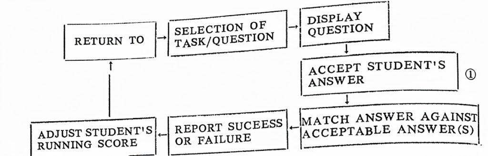
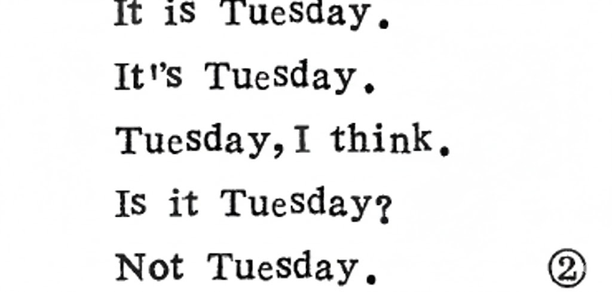
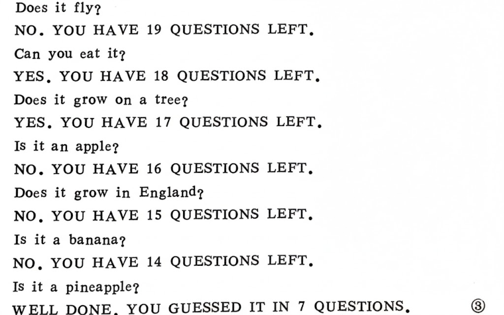
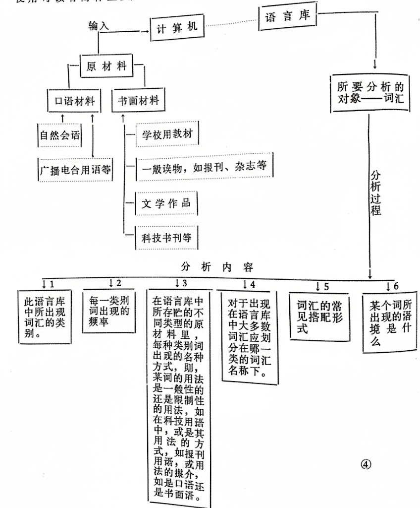

计算机在語言教学与研究中的应用
==================================

**孙建荣**

电子计算机最早使用是在美国和英国，使用范围也很有限。直到五十年代，计算机在教育事业中才显露身手，得到广泛使用。

下面谈谈计算机辅助语言学习（即CALL: Computer-Assisted-Language-Learning）和计算机辅助语言教学（即CALT: Computer-Assisted-Language-Teaching）的一些实际应用。  

句型练习（Drill-and-Practice）——这是在外语教学中教初学者时使用最多的一种方式。根据行为主义理论，语言的学习与掌握要求学习者大量反复地练习，直到学习者对于一个句型的正确使用成为习惯性的动作，换句话说，学习的过程就是形成某个习惯的过程。这样在实际应用中，学习者就可以正确而自然的使用句型。过去在课堂上进行句型练习时，教师必须除了有耐心外，还得集中精力，保持重复每一个句型时的准确性。然而对于人来说，注意力的持久性毕竞是有限的。教师不仅仅要进行示范读/说，同时还要观察每个学生的反应情况。几十次甚至上百次的重复练习，不可避免地影响教师的注意力。计算机的使用可以把教师从这种困境中解放出来。计算机的两个特点一一耐心性与准确性，使其成为句型练习训练时理想的训练人/执行人。同时，教师因此而得到更多的时间观察学生练习的情况。  

计算机在进行句型练习时，除了可以进行拼写、词序。数词以及月份名称等等机械性练习外，还可以进行有意义的句型练习（meaningful drills）语法句型的的掌握可以通过替换词来达到。学习者在替换词时，必须根据每个要替换句子的意义进行选择。如在练习 Is/Are there any+n.?这个句型时,.就得根据要替换的词来确定是用Is there...还是Are there…?.还可以让学习者根据所填的词以及全句意义在句尾加上适当的介词短语，从而使句子意义更加明显，如：  

tea    Is there any tea (in the cup) ?

matches    Are there any matches (in the box)

money    Is there any money (in the bank) ?

apples    Are there any apples (on the table)

这种类型的练习在计算机上可采取如下结构：  

这种结构是常在计算机上使用的一种带有测试性的练习，整个程序的终止可由分数11决定，即在学习者达到某分数后，全部练习便为一个循环。在整个循环中，第四环节是很重要的。初学者在作练习时，常常会给出一些教师意想不到的答案。对于这种情况，在进行计算机程序编写时，就应该予以考虑，例如，某个问题的答案是Tuesday，而学习者在键盘上可能输送进去几种不同形式的答案：

这时，计算机应该能够辨认出以不同形式出现的正确答案。这就要求在编写程序时。尽量将各种可能出现的答案都估计到，使计算机在这种情况下。能做出及时的反、 

如果练习的形式是多种答案选择式（multiple choice），那么学习者选择正确答案的范围就被限制住了。为了更好地发挥学习者的学习主动性和积极性，做多种答案选择练习时，可以不按通常的作法，从已给的几个答案中选出正确的答案，相反可以让学习者从几个答案中选出那个错误的答案。有时，为了训练阅读、辨识正义误句子的速度，还可以规定时间，在单位时间内做完一定数量的题。

示范（Demonstration）——在语言学习时，了解、掌握学习的技巧是十分重要的。这些技巧通常是由教师在课堂上向学生作示范，学生观察、模仿，再自已练习巩固，随着学生对所学技巧的掌握，教师逐渐放手让学生自已运用这些技巧。计算机在示范方面的应用，例如显示语言是如何起作用的，乃是计算机在语言教学中重要而很有价值的作用之一。它可以通过不断变化的图画、表格等来表示语言形式（form）与语言意义（meaning）之间的联系。学习者通过这些直观教具，可以提高理解力。一些语法现象如英语否定句以及疑间句中动词ab的用法；德语从句中的词序；书写汉语文字笔划的顺序及方向等都可以通过简单的动画片形式来显示。  

语言教学游戏（games）——在目前外语教学中，特别是以交际法为指导思想的外语教学中;大量的采用游戏形式：学习者置身于轻松愉快的气氛中进行不同的语言游戏；在语言游戏过程中学习者有意识或无意识地尝试？应用某个新的语言难点。这种练习与句型练习不同的是：后者不断反复地练习某一个句型，会使学习者觉得这个学习过程单调、无聊,甚至会引起学习者的抵触心理从而达不到良好的学习效果。而前者则不同。如在语言教学游戏中常采用的两种主要方式一一竞赛式(competitive)和协作式（collaborative），不论对学龄儿童还是成年人学习者来说，都有较强的吸引力，因为人们在竞赛游戏中想获胜的要求，想在游戏中战胜计算机的愿望，往往成为他们努力掌握所学语言要点及技巧的一种推动力，而这一点在语言实验室中是不容易做到的。下面我们来 看一个例子。在常用的计算机语言教学游戏中有一种叫做TWENTYQUESTIONS。假设所用练习的语言要点是提问，这时，计算机在屏幕上显示几行句子“I am thinking of an object. Try to guess it. Remember I can only answer YES or No. You have 20 questions left”这时，学习者开始向计算机提问，总共可以有20次提问的机会。如：  

这种练习可以个人自已作，看谁最先得到正确的答案；也可以分成小组，一个小组推选出一个在键盘上负贵输入答案的人，"几个亦组之间开展竞赛，看哪个组用最少的提问机会做出正确的答案。前一种方法可以培养学习者独立思考的能力，后一种方法则培养集体协作的意识。小组成员之间常会出现热烈讨论的局面，在这中间他们不知不觉地进行着语言技巧练习，如口头表达能力，运用符合逻辑的思考方法，运用已学过的词汇食助清讯等。  

用于计算机上的语言学习种类繁多，远不止以上这些，限于篇幅，就不多举例了。  

计算机还有一个很重要的用途，就是在语言研究中的应用。二十世纪初期，瑞士著名语言学家索绪尔（F.de,Saussure）提出了言语（parole）与语言（langue）之间的区别问题，前者指的是某一个语言集团的成员所使用的口头语和书面语的语言行为，后者则指的是连系这些语育行为内在抽象的关统。五十年代时,美国群育学家乔姆斯基（Chomsky）在为，又进一步提出语言运用（performance ）与语言能力（Competence）这个区分。所有这一切的中心在于：从人们使用诺育时所表现出来的各种现象来着，不的内在系统应该是什么。在这一任务面前，计算机使用可以有两种用途，一是再语言库的基础上（corpus-based），对所出现的这些语言行为进行整理、分类；另一种用途是发展人工智能语AL（Artificial intelligence），分析研究语言行为的内在联系以及其潜在的体系。例如对于词汇的分析与研究。（请看前面的分析表）  

上述计算机对词汇进行的分析与研究有什么实际应用呢？首先，其分析与研究的结果在语言教学中有很重要的作用，例如在进行教学大纲的制定与教材编写中，以分析与研究得到的结果为基础，确定教学中核心词汇的范围（从上图中分析内容2，3可以提供这方面的情况）；还可以确定进行语义某一方面的词汇教学（根据分析内容5中提供的情况）；以及分析某一类型教材中在词义理解上的困难等等。上海交通大学在这方面已迈出了可喜的一步，他们通过用计算机对语言库中储存的语言原材料进行分析，研究了出现在科技英语教材中的常用词汇，为制定公共外语教学大纲和编写科技英语教材提供了科学依据。在国外一些大学里都有这种类型的语言库，如英国伯明翰大学的SNOBOL和CLOC语言库，牛津大学的OCP语言库，伦敦大学的CASETEXT语言库，兰开斯特大学的LAB语言库。美国有些大学也有类似的语言库。在我国上海交通大学有LEXSTAT请言库。  

计算机的另一重要用途是发展人工智能语AL，它可以在计算机上对语言教学和语言研究进行更深一步的观察和分析，如研究语言形式与语言意义之间的关系，研究在语言功能中，语言意义（language meaning）和语言用法（language use），即语义（semantics）与语用（pragmatics）之间的关系。在现有的许多计算机程序中，很多在这方面已有了突破，例如对课堂教材分析，为训练阅读技巧提供情况。人工智能语AI的另一种应用已为大家熟悉，即机器翻译，这里就不再赞述了。

计算机还可用于储存教材。计算机如配有印字机和相应的软件，便可进行文宇处理（word processing）。这个文字处理功能不论是对于编写教材、存贮教材，还是进行写作训练，都有很大的便利。比如这一学期使用过的教材或相应的练习材料、考试题等可以输入到计算机中贮存起来。等到下批学生上课时，这些教材、练习材料以及考试题等可以根据学生的具体情况对这些材料在内容上进行适当地增删，以达到更理想的教学效果。所有这些增删工作可由教师坐在计算机前进行，这个过程有些类似排字工作，在原有的基础上，添上新的内容或去掉暂不用的部分，保留的部分就不再从头打印一遍，直接通过计算机的“排字”，然后通过计算机输入到其附件一—印字机上直接印出来。这种存贮材料远比以书面形式保存便利，土百页份的文字可以通过计算机存贮到面积只有比一张纸小一些，厚度为一厘米左右的软磁盘上（disc）。用的时候，只需把软磁盘输进软磁盘机里（disc-drive)，计算机把传输进来的语言文字符号经过处理，在屏幕上以文字形式出现或通过印字机直接复制成书面材料。 

一个语言教学大纲制定的完善程度，教学工作的完成情况以及学习者的学习进展等等都可以在测试中通过所反馈的情况进行检验。语言测试是语言教学中重要的组成部分之一，也是教学的最后一个环节计算机可以分析测试中的各项成绩，取得数据，然后根据这些数据，对测试卷子及各个测试项目等进行修改、完善，使得测试工作能够胜任不断变化的考生情况和教学情况，更精确的反映学习者的实际语言学习水平。对于大范+11..围内测试成绩的分析，尤其是地区性，甚至全国范围的外语考试、普查等，计算机在这方面的应用可以大大减少所需的人工劳动力。在编好程序后，只需把所有要分析的测试成绩以及其它原材料，如参加测试的人数、性别、年龄等等输进计算机，计算机便可制出一份详细的分析结果来，如平均分数、最低/高分数、低于或高于平均线的比例、测试卷子中哪些项目答对的最多或最少，从而为分析、改进这些项目提供数据等。计算机也可用于自我测试，学习者自已进行某些方面的测试，计算机屏幕上随时可以显示出“正确或错误的情况。但从目前来看，使用计算机进行大规模测试，有一定的困难，一是费用昂贵，不可能让上千甚至上万的人同时在一起参加测试；二是在某几台计算机突然出现故障时，会得出错误的结果，影响重大的决定，但所有这些不足之处，随着科学技术的发展，是一定会得到解决的。  

计算机用于语言教学、语言学习和语言研究的历史虽然不长，但却显示出了巨大的潜力。这对于发展语言教学的新理论，探索学习者如何更好地学习和掌握第二语言，研究语言的内部结构以及语言用法与社会各因素之间的密切联系等，都将起到很大的推动作用。目前我国计算机在这方面的应用已经有了可喜的开端。随着科学技术的发展，我国的外语教师将会更好地利用计算机，为更科学、更快地发展我国的外语教学与研究工作做出新的贡献。  

① 见《语言学习中的计算机》，J. Higgins 与 T. Johns，Collins Educational，1984，P.29  

② 同上，P.41  

③ 同上，P.80  

④ 同上，PP.88-89  

*本文发表于《外语教学（西安外国语学院）学报》一九八年第二期（总字第二十二期）*

