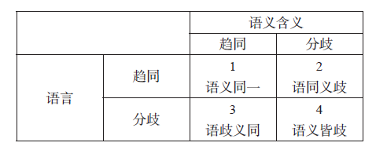

中国文学与中国哲学的天人合一观、个群一体观以及知行合一观不可分离，是以人性本善及志行良知为生命根本。天地之美即人性之美，人之美即对天地、自然之美的感受，也就是中
国文学的根本主题。第二，中国文学是人生体验的真情实意诉之于美感的语言表露。中国文学一向重视文字语言的表达，所谓“言为心声”“君子修辞立其诚” 都在强调用语文的真
实来实现体验的真实，此一要求把诚正作为文学美感的出发点，张扬了原始的创造力。第三，中国文学重视想象的可能性，同时兼顾现实情感的合理性。中国文学有丰富的想象力，透
过传统的诗词歌赋表达得淋漓尽致，但又不会陷溺于怪力乱神之中，近代以来的有些小说诲色诲淫，只是别有用心的时代偏道而已。第四，中国文学阐释生命的奋斗精神及对人生理想
价值的追求，把对一个时代的精神的把握展现了出来，如《楚辞》《西游记》《红楼梦》等。当然也有不少体现了一种潜在的批判意识，尤其在近代文学中，这也是中国生命哲学的表
达。第五，中国文学是在道德实践层次上的自由创造。从深层次看，文学是生命的延长，生命的道德意识与自由自主精神也即文学创作的灵感所在，中国的唐诗尤其体现了这一点，读
杜甫与白居易尤有此感。第六，中国文学体现及表露人生形形色色，同时反映时代与社会的处境，具有强大的时间与时代意识，消解了悲剧与喜剧的极端性。这一特性反映在五四以来
的新文学之中，究其目的，仍在追求理想的人生，以及人的存在价值与尊严。第七，文学是中国人的人格教养的重要成分，在开放的生活世界中表现为合乎情理的语言与行为，中国的
新文学更能彰显此一重要要求。第八，文学在文史哲认识的基础上实现与提升生命的活力、意义与乐趣。中国文学是构成世界文学的重要部分，有其特殊性、普遍性，也有其批判性，
对人之为人有极高的自觉，不但促发了中国文化的影响力，也提升了世界文化的品质。

文化认同中的融合与分歧：语言学视角的反思
=========================================

文化认同这个话题在全球化中具有非常重要的地位。全球化给各民族文化提供了认识自己（己文化/i-culture）、理解他人（他文化/it-culture）的平台，飞
速发展的高科技与海量数据信息已经成为人类日常生活的一部分，对文化认同也起到了催化剂的作用：文化认同不仅仅是学术研究的话题，它已成为社会每个成员每天都在接触的信息
，并产生不可估量的直接影响。全球化自开始之日起，便经历着巨大的变化，有些变化我们预测到了，更多的变化则是人类无法预测的（或者是预测错了）。《纽约时报》记者托马斯
·弗里德曼在2005 年出版的畅销书《世界是平的》中描写了21 世纪初期对全球化的观感：期待、兴奋、希望。而三年之后，他又出版了与前书格调大不相同的另一本书《世
界又热又平又挤》，尽述全球化给世界带来的环境灾难，强调人类需要通过绿色革命以还原地球的本色。无独有偶，2009 年，美国经济问题高级咨询顾问、作家戴维·斯密克在
其畅销美国的《世界是弯的》一书中，提出了与弗里德曼《世界是平的》一书不同的观点，认为世界经济的不稳定性会带来潜在负面影响。这些关于全球化的论述与我将谈到的文化认
同问题有近似之处：全球化促进了对多元文化的认可，高科技提供了文化传播的平台，而语言在其中再一次起到了进行传播最有利的媒介功能。

当这只满载全球化梦想的大船扬帆驶在时代的大海上，忽然遇到了全球化航道上漂浮着的冰山，这艘高速行驶的全球化大船“触礁”了：在提倡多元文化这么多年后，社会中以文化为
由的冲突不断出现，涉及教育、经济、政治以及日常生活中诸多领域；在这场仍在持续的疫情中，人类遭遇严峻的考验，我们已经清楚地看到人类在全球化中出现的“冲突”，不论是
意识形态方面的冲突还是经济贸易往来的冲突。我们有必要对全球化中的文化认同这一命题进行反思，有三个反思的切入点：第一，如果文化认同是全球化的一个重要前提，在后疫情
时代，这种认同的趋势是倾向融合还是分歧？第二，文化认同中的融合与分歧又各会出现何种特征？第三，在文化认同的融合与分歧之间，是否有某些“调节”因素/ 变量的存在？
针对这三个反思，可以提出三种假设：假设一，在后疫情时代，分歧会成为融合的前提；假设二，文化认同的融合会更加谨慎，而分歧则会以获得话语权为由而受到认可；假设三，存
在于融合与分歧之间的最大的“调节”因素/
变量是出现在社会面前的严峻危机关头。我将尝试从文化认同中融合与分歧的角度出发对这些假设进行描述，并分析语言在认同中所起到的工具作用。

在协调相对稳定的社会文化与快速发展的经济之关系时，我们将可能面临如下选择：其一，当文化更倾向于接受经济快速发展的需求时，其结果更多是融合性；其二，当经济的快速发
展要置身于社会文化之下时，其结果更倾向分歧性。民族文化与经济发展之间的这种关系在不同的社会中会出现不同的互动，产生不同的结果。后疫情时代各国将尽快恢复经济，进而
进入经济持续发展的阶段，但关于其自身经济与全球经济如何接轨将出现一些令人深思的现象：是从自身经济需求出发去寻求与全球经济的融合，还是将前者置身于后者之中？如何选
择将是对各国的巨大挑战。上述假设一便更倾向于前一种可能，即强势文化+ 强势经济体会将自己文化身份的认同作为后疫情时代经济复苏的首选。

民族文化对文化自信的期待与追求，在全球化中与其他文化自信进行互补，同时也出现冲突；在希望建立文化自信（认可度）的同时，也在不断地试图使这种“己文化自信”（
i-culture identity）得到“他文化”的认可。在全球化背景中，为了能在经贸、科技、世界事务等领域占有一席之地，英语语言能力成为“世界自信”认可的最
明显（的语言）标志，世界上有实力的国家在提升国民英语语言能力上作出了巨大的投入，不论是国家教育体系中的课程设置，还是社会上众多的语言提升服务项目，这成为全球化大
背景下出现的一种跨越国境的共识与行为。在这种通过语言而进行的“全球融合化”过程中，人们已经开始注意到一些不和谐的音符：一些表示世界性认可的最高层次平台（例如诺贝
尔奖项）出现不被“接受”的异声；在本次疫情中，以各国利益为本的许多争执（比如围绕世界卫生组织的许多棘手问题），也让我们看到上述假设二的选择。

2020 年的新冠肺炎疫情在全球范围内对人类社会制造了一次“疫情割分”：以各国领土为界而实施“隔离”，并保持社交距离。这种“疫情割分”给我们提供了一次规模大、代
表面广的文化层面的展示 ：人类的（在同一文化中的对内的）一致性（ conformity） 与（对外的）个性（ nationalidentity） 在语言的表达上
一览无余。批评话语理论认为话语背后显示出意识形态和权力关系①，而话语的使用则表示出语言使用者意图代表的“身份”，身份作为自我认知，成为社会结构和利益的联系纽带而
发生作用，形成“自我”与“他者”。②通过对近期以来不同场合语言使用的分析，我们可以清楚地看到，在语言使用中和谐度减少，谴责与攻击性增加，当语义上倾向于正面表达的
话语与语用含义成正比时，语言使用者在其文化身份上会作出相应的选择：减少或增大其文化融合度。人们在交际时，理想的语言使用是话语与其含义趋同，即言此意此（汉语追求的
最高境界便是“直接说”），但更多时候，语言使用是话语趋同而含义分歧，即言此意彼（如指桑骂槐、含沙射影、指鹿为马、借古讽今、拐弯抹角、旁敲侧击等）。语言（utte
rance）与语义（implicature）之间几种关系的组合如下表：

   图 1 语言与语义之间关系的组合

语言与语义之间关系的这些组合会受到不同因素的影响，比如语言与社会的外在关系（社会提供语言使用的语境）、语言与人的内在关系（人是语言使用的主体）等。社会的发展变革
使语言更具有复杂的社会性，从而超越作为思考和沟通工具的范畴，而呈现出建构性的特征：激发想象力、煽动情绪、建构社会现实、掌握国际舆论中的主动权、塑造国家形象等。

互联网抹平了山川、河流、大海、国境之类的隔阂，缩小了物质文化之间的差异，然而，没有抹平的是文化和语言依旧给人类沟通、交流带来的隔阂；高科技提供的跨越距离的交流平
台，反而给文化和语言提供了更好发挥自身特色的机会——将隔阂扩大化了。纵观历史，人类社会在面临创伤型重大事件时（比如几次世界性的经济或金融危机、环境变化的蝴蝶效应
、因地缘政治冰山而引起的大国博弈等），一个很自然的反应是面和实分，即首先保护各自的利益成为应对的主要手段。每次重大创伤事件之后，人类社会都会相应作出调整，当今“
有距离的社交”（ distancesocializing ）
是否会是后疫情时代的一种新现象呢？“禁足”或“在家工作”是否已成为本次疫情带给人类的两种最常见的日常生活模式？诺贝尔经济学奖获得者丹尼尔·康纳曼 2011 年在
其心理学畅销书《思考，快与慢》中提出人类进行思维时有两种模式，人类思维经常依赖“直觉”，碰到难题时，则需要通过思考来寻求决策的依据：模式一的思维特点是速度很快；
模式二则比较慢。因此，康纳曼建议人们决策时，要在两种思维模式之间寻求平衡与互补。心理学上提出的判断与决策的理性模式也许有助于我们更好地认识与理解人类在不断追求其
文化身份过程中，或在融合与分歧之间作出选择时会出现的矛盾现象：选择融合，也许是为了更有利于分歧，而分歧又是我们进行融合的平台，当社会面临严峻危机关头时，分歧也许
会更占上风。这是上述假设三的推测。

今天我们从不同的角度反思与探讨文化自信时，有两类文化一定会对我们的思路产生影响：一类是我们来到这个世界时很快变成我们基因的一部分，它通过语言的表达、行为的展示，
呈现出“己文化自信”，如同诗人流沙河在其《就是那一只蟋蟀》中的描写：“中国人有中国人的心态，中国人有中国人的耳朵”，我们可以加上“中国人有中国人的自信”。另一类
则是我们在社会中（后天）形成的（比如社会组织内形成的组织文化等），它同样通过（组织化了的）语言的表达、（组织化了的）行为的展示，呈现出我称之为（组织化了的）特有
或合成文化（ idio-culture）；这种文化在一定的环境中会产生巨大的爆发力、吸引力、影响力，并在一定情况下可暂时弱化第一类文化。

融合始终是人类追求的目标，而分歧带给人类的也许是社会的不断变动，这些变动在一定程度上促进了社会的发展；人们在后疫情时代的思考也许要面对现实：“己文化自信”本身会
促进基于文化的（对外）分歧，带动（对内）融合；在与他文化的交流中，严峻危机事件将可能直接引导人们倾向维护“己文化自信”方面。
