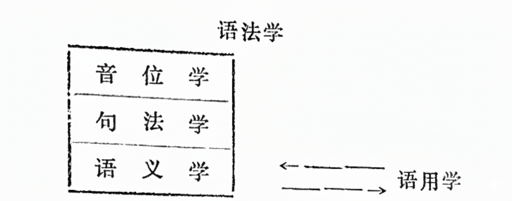
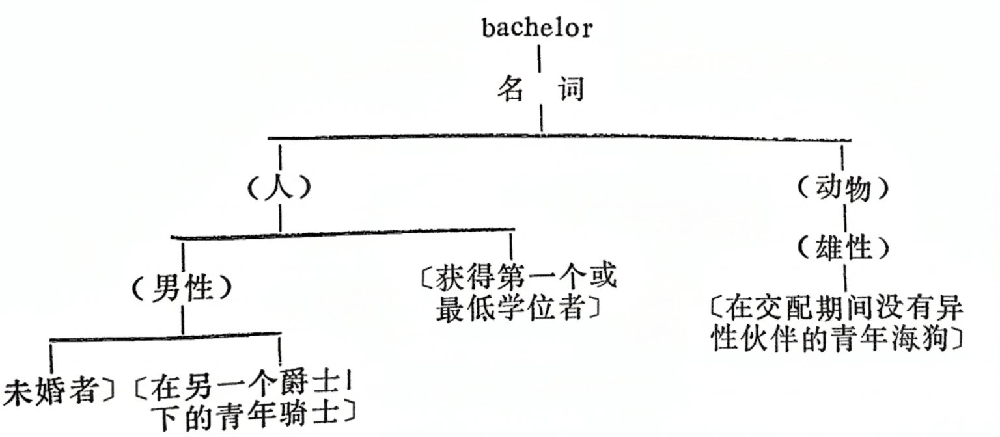
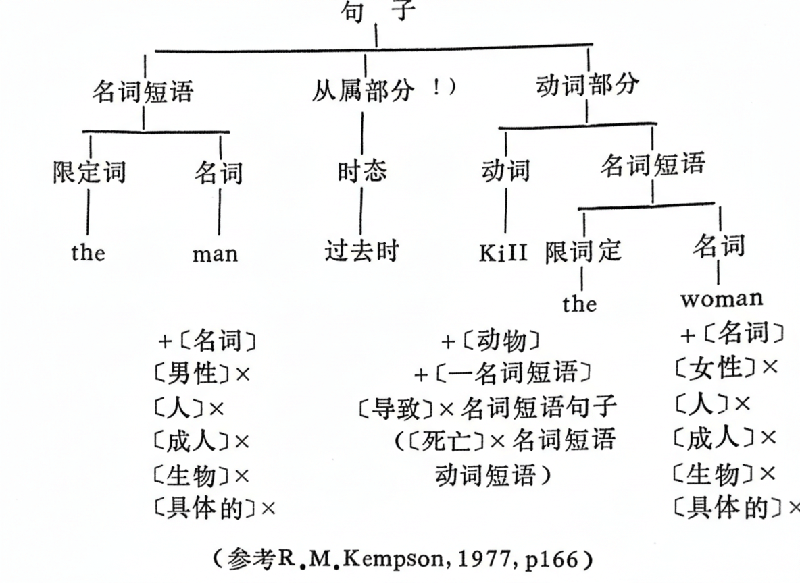

语用学及其方法论
=================

孙建荣  

语用学是一门年轻的学科，在西方语言学界它虽然获得了应有的地位，并显示了它在理解交际实质时的重要性，但在国内语言研究中，还很少论及。因此，对语用学的内容和应用作一简要介绍，对我们不是无益的。  

**一  问与答的启迪**

在讨论语用学的内容和意义之前，不妨先看两个例句：  

(1) OTHELO: Indeed ay, indeed: —discern'st thou aught in that? Is he not honest?  
IAGO: Honest, my lord?  

（Shakespeare, *Othello*, Act III, Scene III）  

这里，Iago 是以反问句（Echo Question）的形式回答 Othello 的问题。这段对白摘自莎士比亚著名悲剧《奥赛罗》。对话的地点是在意大利威尼斯城堡的花园中，剧中的奥赛罗与衣阿果面对面地在花园里谈话，很明显，在这种场合衣阿果不可能听不清奥赛罗的提问。那么衣阿果为什么要以反问句的形式来回答奥赛罗的问题呢？  

(2) A. What do you think of the lecture?  
B. The lecture-hall is very big.  

很明显，B 没有直接回答 A 的问题，为什么 B 要选择上面那种回答方式？在日常交际中，在文学作品中，类似上述这种“所答非所问”的例子俯拾皆是。如果，仅仅从语义或语法的角度来解释这种类型的例子是很难的，有些甚至根本不可能用语义、语法规则来解释清楚。而语用学的重要作用之一就是帮助人们来分析、解释这种语言现象的。  

由此可以得到启示：语用学是研究语言实际运用的学问。David Crystal 给语用学下了如下的定义：  

 “（语用学是）符号学的三个主要分支之一（其它两个分支是语义学和句法学）。在语言学中，人们已经从语言使用者的角度，特别是他所选择的语句形式、他在社会交际中应用语言时所碰到的困难，以及在交际行为中语言使用者所选择的语句形式对于其他参加者的影响等等使用语用学这个术语来研究语言。”  

Levinson 在他最近出版的《语用学》中也说：  

 “语用学以一种新的眼光去分析应用语言学中的资料及方法。这样，语用学可以说是一种比语义学更与社会语言学相近似的领域。（p. 33）”  

可见语用学是研究在具有自己目的的话语场景中的语言——即人们如何应用语言达到某种预定的结果，正如 Leech 所说的：  

 “不懂得语用学就不可能真正理解语言自身的实质：即语言在交际中是如何使用的。”  

**二  语用学和语义学的区别与联系**

当我们说语用学是用来分析言语及语言实际用法中的句子和词的时候，人们会问：语用学和语义学之间究竟有何区别，又有什么联系？下面就来讨论这个问题。  

Charles Morris 在他的《符号的基础与理论》（1938）一文中第一次勾画出了符号学的轮廓，他将其分成三个明显的分支：即  

- 句法学——研究符号之间形式上的关系的学科；  
- 语义学——研究“代表物体的符号关系”的学科；  
- 语用学——研究“表示解释者的符号关系”的学科。  

一般地来讲，语言学由两大部分组成：  

   Figure 1 语法学、语义学与语用学的关系图式

上面的图式说明：语义学和语用学既有区别又有联系。它们之间的区别在于：语义学是以一种抽象的方法来解释词义的，这种解释不带有任何语境的语言意义。例如对 “bachelor” 一词进行语义分析时，可采用下图：  

   Figure 2 Bachelor语义分析图式

图中所包括的内容可称为语法标志，圆括号中的是语义标志，前方括号中的则是区分标志。图中所表示的 bachelor —名词—(人)—(男性)—[未婚者]；以及 bachelor 名词—（人）—（男性）—[在另一部门服役的青年骑士]）等不同的意义，尽管出现在每一句中的 “bachelor” 由于有不同的意义而变得在具体句子中的意义模棱两可，但人们还是能够通过已知的词法信息和不同的标志，在特定的语境中得到 bachelor 一词的确切含义。例如下面这个句子：  

上面的图式说明：语义学和语用学既有区别又有联系。它们之间的区别在于：语义学是以一种抽象的方法来解释词义的，这种解释不成有任何语境的语言意义。例如对 "bachelor" 一词进行语义分析时，可采用下图：

   The bachelor is in the garden.

另一个例子是：  

   The man killed the woman.

   Figure 3 句子语义分析图式

 

通过上图，语义学家可以通过抽象的方法，分析和对比上句与下面这句 “The woman was killed by the man” 之间的表层结构与深层结构（见 Kempson，同上，pp. 165—168）。  

和语义学不同，语用学则是通过分析语言的语境化意义，来研究话语的各种语言现象。例如，见到自动售货机上贴着一张说明：  

    “此自动售货机不接受某些 10 分的硬币”  

那么我们会很自然地认为，说明中的 “some” 一词意思是 “some-and-not-all”（只是一些而不是全部）。但假设某个人连续不断地往自动售货机中塞硬币，而不起作用，他会说：  

   "some, and perhaps all, ten cent pieces are rejected by the machine."

（一些，也许是所有 10 分的硬币是不会被这台机器所接受的）  

这句话同样也可以达到交际的目的，而并不会出现矛盾的情况。面对类似例子，语义学家也许会说 “some” 一词在 “some-and-not-all” 和 “some-and-perhaps-all” 之间含有模棱两可的意义。这里只有用语用学才能说明其不同的含义，因为：  

这里只有用语用学才能说明其不同的含义，因为：

   "语言用法中的语用原则可以通过对于话语的理解而后系统地表示出来，这比其传统或文字上的意义更准确。"（Levinson，同上）  

由此，可以作出结论：语义学与语用学之间的区别在于——两种学科都与意义有关；两者的不同之处可以通过对 “mean” 这一词的不同用法而显示出来：  

(1) What does X mean? （X 是什么意思？）  
(2) What did you mean by X? （你用 X 想表达什么意思？）  

语义学从传统的观点出发认为意义是由两方面的关系而决定的，如在句 (1) 中。语用学则认为意义是由三方面的关系来决定的，如在句 (2) 中。因此，在语用学中，意义是作为与语言的使用者有关的东西来决定的，而在语义学中，意义只是作为某个已知语言表达方的单纯组成部分，与具体的语境、讲话者或听话者隔断开来。（Leeck）  

讲语用学和语义学的区别，是为了引起人们对语用学的重视，这决不是说它们二者之间是毫不相关的。实际上二者虽有区别，又紧密地联系在一起，这就是通过语义（语法的一部分）与语用（语法应用的一部分），互相补充，发生着相辅相成的作用。  

**三  语用学研究的方法论**  

语用学通过对指示词、会话含意、前提以及言语行为等方面的研究来分析话语的意义。对于指示词这一概念我们并不是很生疏的，但其它几个概念需要解释一下。  

会话含意（conversational implicature）是 H. P. Grice 在他的《逻辑与会话》（Logic and Conversation）一文中首先使用的。他说，在所有的交际活动中，在讲话者与听话者之间存在着一种合作的默契关系，即合作原则（Co-operative principle）。就是说，在交谈中根据交谈的话题和共认的目的，使说话的内容适合交谈的需要。据此，他又提出了会话含义的四条基本准则：  

数量：提供适当数量的信息，即：  
① 提供的信息内容要适合需求。  
② 不要提供超过需求以外的信息。  

质量：提供真实的信息，即：  
① 不要提供不真实的信息。  
② 不要提供缺少根据的信息。  

关系：提供有关的信息。  

方式：提供的信息要明白、清楚，即：  
① 不要用晦涩难解的语言。  
② 不要在所有的语言中包括模棱两可的意义。  
③ 简洁、明快（不要用不必要的冗长的语言）。  
④ 表达的内容要有条理性。  

这些准则的主要意思是，在交际中，人们在提供信息时应是真心的，讲有关的东西，并且要表达清楚（见 Levinson，同上，p. 102）。这些规则乍看好象是描写哲学家心中的完美天堂，似乎在实际交际中没有人会象上面所讲的那样说话。但事实上，人们确实在遵循这些准则，而这些准则也确实依附在某个深层结构上。例如：  

（3） A: What is the time now? （几点了？）  
   B: The second class just started. （第二节课刚开始。）

从字面上来看，B 的回答与 A 的问题没有连系，因而违反了数量准则与关系准则。可以说 B 的回答不是合作性的。但是我们若做出一些假设，如在这一问一答之间存在着某种联系，即第二节课通常开始的时间这个事实，那么，从某些深层结构上来说，我们可以理解 B 的回答是合作性的，即如果 A 知道第二节课开始的时间，那么 A 的问题就得到了回答。正如 Levinson（同上，pp. 102—103）所指出的：  

正如 Levinson（同上，pp. 102—3）所指出的：

在这种情况下，推论的出现可以维护合作的假设：只有通过做出这种与表面现象相矛盾的推断，推论才能在开始时出现。Grice 的观点并不是说我们已经将这些准则依附于表面的结构上，而是在有可能的地方，人们会将我们所说的话理解为在最后那一层结构上同这些准则相一致。

这里所说的推论便是 Grice 所称为的会话含意。语言学家之所以对这些准则发生兴趣是因为“这些准则能在超越所发出的句子的语义内容之外引起推论”（Levinson；同上，p. 103）。会话含意是以话语的内容及一般言语交际之合作实质的具体假定为根据的，因此它与其它一些术语如逻辑内涵、内容和逻辑推论等是不同的，这些逻辑术语通常是指单纯从逻辑内容或语义内容中演变出来的推论。  

上面提到的四条会话准则同语法规律是有区别的，如：

   *Ate he there food*

这个句子是不符合语法规律的，因而从语法角度看，是不正确的。反之，如果一个句子不符合会话准则，象前面提到的例句 (2)，但这个句子本身还是正确的英语句子，因为它符合语法规则的要求。我们将句子不符合会话准则的现象称为 **flouting**，这就是会话含意的来由。  

Grice 给会话含意下了定义，并对如何判断会话含意提出了一个一般性的格式：  

①讲话者已说出了 p；  

②讲话者被认为是在遵守会话准则，或起码是遵守合作原则；  

③为了能使说话者说出 p 并确实遵守会话原则或合作原则，说话者必须承认 q；  

④说话者必须知道，如果 A 要是被认为是合作的，那么就必须假定 q，这是共知的常识；  

⑤讲话者没有做任何事来阻止听话者，并承认 q；  

⑥因此，说话者试图让听话者也承认 q，而且通过说话，p 就已暗示出了 q。

从上面这个格式中，我们可以说，说话者与听话者双方都知道 p，讲话者知道 p，讲话者了解到听话者也知道 p，而听话者也意识到讲话者了解他也知道 p，如此等等无限下去。  

现在我们可以来理解本文一开始所举的 (1) 和 (2) 两个例句。  

- 在例句 (1) 中，Iago 借助于违反数量准则和质量准则，向 Othello 暗示，他（Iago）认为“他（指 Michael Cassio）是不忠实的”，从而达到挑拨 Othello 对 Cassio 的偏见。  
- 在例句 (2) 中，B 对于关系准则、数量准则的违反引出这么一个潜台词，即他认为讲座并不怎么好。  

前提（presupposition）也是语用学中一个重要的成份。什么是前提呢？Levinson 是这样解释的：  

   话語 A 从语用的角度预设一个命题 B，即只有在各方都知道 B 时，A 才是适当的。

换句话说，要想顺利地实现一个前提，必须注意两个基本概念：一是得体（或适当），二是共有的常识（或共同知道的常识）。在前面的例句 (3) 中，A 的话语可表示假定他是不知道时间的，而其他人也许知道时间，在这种情况下，他认为 B 也许知道时间，等等。  

在语言学中另一个因常被引用而“很有名”的例句是：  

在语言学中另一个因常被引用而"很有名"的例句是：

   The king of France is bald. （法国国王是英明的。）  

从语义和语法上来讲，这个句子本身是对的，但从语用的角度来说，则是错的，因为此句中所包括的前提是错的：即根本就不存在法国国王这种事。因此，这个句子无任何意义。  

语用学中另一个重要的方面是言语行为。让我们看下面的例句：  

（4） I apologise that I was late. （很抱歉，我来迟了。）  

按照 Austin 的理论，这个句子并不仅仅是在说事情，即描述事物的状态等等，而是在积极地做事情。当一个人说 “I apologise”（我道歉），他事实上已经做出了道歉的行为，因此，别人就不能反驳说 “No, you didn’t apologise”（不，你刚才没有道歉）。  

Austin 认为，语言中有一种特殊的类别，即某些宣述句（declarative sentences）。这类句子是真实的还是不真实的，Austin 将这类句子称为**行为话语**或**行事句**（performatives），这些句子的动词则称为**行为动词**或**行事动词**（performative verbs），诸如：be, christen, declare, apologize, dub, object, promise, warn 等等。  

一个人说话时是否同时也在完成某些动作，这要由以下三种情况来确定：  

①言内行为（locutionary act）：带有确定意思和指述/参照关系的话语（句子本身）。  

②言外行为（illocutionary act）：借助于句子有传统联系的关系，在发出话语中，宣称某个意义如帮助、许诺等等（句子的含意）。  

③言后行为（perlocutionary act）：通过说出的句子从而在听话者身上发生相应的作用，这种作用对于话语的环境来说是很特殊的（对于听话者的影响）。  

（Levinson）  

举个例子来说明上面的三种行为。假如我正在写信，突然我的笔没有墨水了，我就说：  

   "I've run out of ink." （言内句）  

意思是：  

   "I want some ink." （言外句）  

而言后效果也许是有人能给我点儿墨水或借给我一支笔。  

在不同的语境中，同样的言内句可能会产生出不同的言外效果。比如：  

   "What sort of book is this?"  

这句话，根据上下文，可能会有如下的言外效果：  

- 说话者想让听话者告诉他这是本什么样的书；  
- 说话者很生气，因为听话者选的书不对；  
- 说话者认为这本书的内容糟糕透顶；等等。  

反之，不同的言内句则可能带有同样的言外效果。例如：  

① Would you please sit down?  
② Won't you sit down?  
③ Can you sit down, please?  
④ Will you sit down, please?  
⑤ Take a seat, please.  
⑥ Sit down, please.  
⑦ Take a seat.  
⑧ Sit down.

这些言内句尽管形式不同，但所包括的言外效果是一样的。所以，**言语行为**这一术语通常指的是**言外行为**。  

前面已说过，行为话语不可能是真实或不真实的，但它们有的时候也会出现错的地方，就是说，如果行为话语不符合某些特定的条件时，这些句子便是错的。Austin 将这些特定条件称为**适恰条件**（felicity conditions）。例如，一个小孩对他的伙伴们说：  

   "I declare war on × country." （我宣布对 × 国开战）

这句话并不会起任何真正的作用，因为这个小孩并不拥有对别国宣战的权利。  

Searle 将适恰条件分成四类：  

命题内容：任何一个命题 P。  

预先默契：  
① 说话者对于 P 的真实性有证据（根据，等）  
② 说话者与听话者都不清楚听话者是否知道 P（或听话者是否需要提醒一下才会知道 P）  

决定实施：说话者相信 P 的真实性。  

承担义务：作为对效果的一种保证，即 P 代表事实上的事情状态。  

因此只有下面的几个条件符合之后，说话人（S）才能请求听话人（H）执行/做一个动作（A）。  

适恰条件：请求  

- 命题条件：要做的动作 A 或 H。  
- 默契条件：  
  ① S 相信 H 能够做 A。  
  ② H 不经过提醒是否会去做 A 不太清楚；  
- 实施条件：S 确实想让 H 去做 A。  
- 义务条件：作为动员 H 去做 A 的尝试。  

在研究语言用法的理论中，**言语行为理论** （Speech Act Theory）也许是最能引起人们兴趣的课题，上面所举的只不过是语用学中言语行为理论应用的几例。

就语言教学来说，为什么要学习语用学呢？在学习过程中，我们发现同一句话，在不同场合有不同的含义。如：

   "Would you mind...?"

在一种语境中是一种客气的说法，在其它语境中又带有不客气或讥讽、挖苦之意。这是为什么？语用学正是帮助解释这一类问题的。

下面，我们引用 Levinson 一段叙述语用学实际应用的话，作为本文的结来语：

   "语用学在所有的领域中，对于人们如何理解话語，有着实际的应用作用。这些领域如修辞学的研究、文学的研究，并不是直接与实际问题有关系的。同时也包括那些主要解决交际中出现的问题诺领域。正是在这些领域中，语用学的应用具有直接的、实际的重要性。在这一点上，语用学在四个方面特别显得大有用武之地：如应用语言学（即学习第二语言的理论与实践）；人与机器之间交际的研究；研究交际者在面对面的交际场合中存在的困难；以及他们在非面对面的交际中的困难。在这四个方面，运用语用学的洞察力有助于减轻交际上的为难问题。"

**主要参考书目**

Austin, J. L. (1962), *How To Do Things With Words*, Oxford, Clarendon Press  

Crystal, D. (1980), *A First Dictionary of Linguistics and Phonetics*, Deutsch  

Grice, H. P. (1957), “Meaning”, *Philosophical Review*, 67  

Grice, H. P. (1967), “Logic and conversation” in P. Cole & J. L. Morgan (eds), *Syntax and Semantics: Speech Acts*, New York, Academic Press 

Hymes, D. H. (1972), “Models of the interaction of language and social life” in Gumperz & Hymes (eds)  

Katz, J. J. & Fodor, J. A. (1964), “The Structure of a Semantic Theory” in J. Fodor & J. Katz (eds), *The Structure of Language*, Prentice-Hall, Inc., Englewood Cliff, New Jersey  

Kempson, R. M. (1977), *Semantic Theory*, Cambridge U. P.  

Levinson, S. C. (1983), *Pragmatics*, Cambridge U. P.  

Shakespeare, W. *Othello* in *The Complete Works of William Shakespeare*, P915, Octopus Books Ltd.

*本文发表于《外语教学》（西安外国语学院学报）1985年第1期（总第21期）*