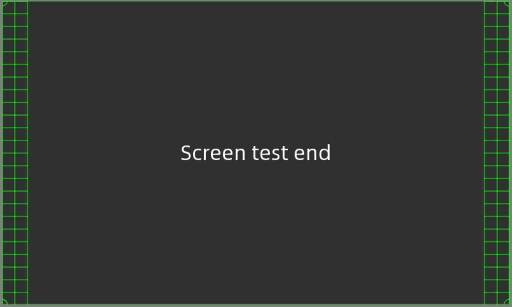
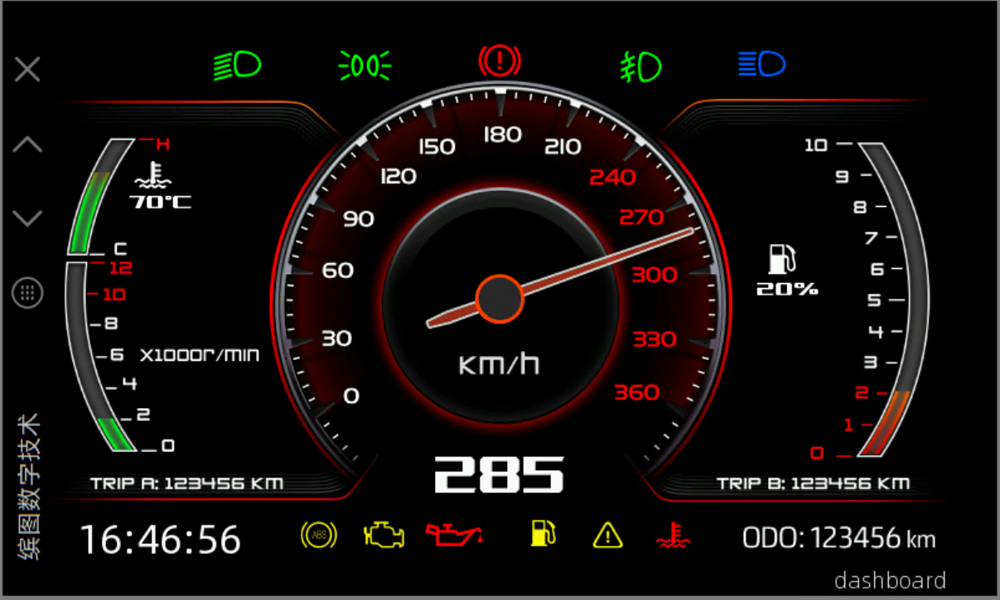
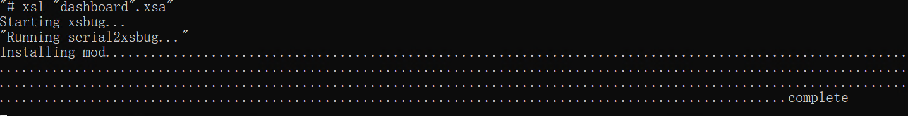
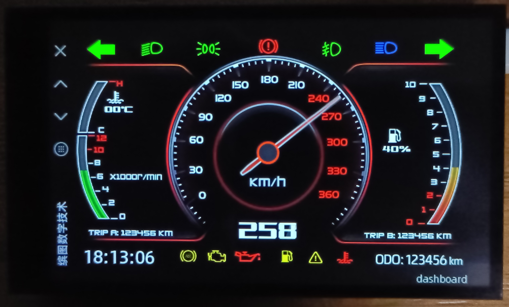

*******************
快速入门 先看这里!!
*******************

[English]

本文档希望用十分钟的阅读以及三十分钟的实操时间, 使用户获得缤图平台开发软件的第一印象. 包括PC平台的模拟器运行和硬件平台运行两个部分.

* :ref:`get-started-run-on-windows`
* :ref:`get-started-run-on-hardware`

.. _get-started-run-on-windows:

模拟器运行
============
模拟器在win10/11环境下测试运行

.. code-block:: batch

    1. 安装Microsoft Visual Studio 2022 Community开发环境
        * 下载 Microsoft Visual Studio 2022 Community installer
            https://www.visualstudio.com/downloads/
        * 启动安装器,在workloads标签选择"Desktop development for C++"选项. 在"Individual Components"标签,
          选择"Windows 10 SDK (10.0.19041.0)" (win10会自动选择, win11需要手工选择). 处理后续安装.
        * 确认可以启动"x86 Native Tools Command Prompt for VS 2022"命令行终端
    2. 配置evolayer开发环境,读入host底包
        * 下载发行包 EVOLAYER_lts.zip 并解压缩到x:\EVOLAYER_lts, 磁盘可以自由选择, 这里假设存储在x:
        * 设置环境变量 EVOLAYER 为 x:\EVOLAYER_lts
        * 在环境变量Path里加入%EVOLAYER%\build\bin\win\release
        * 设置环境变量 FONTBM 为 %EVOLAYER%\third_party\fontbm\fontbm.exe
        * 启动"x86 Native Tools Command Prompt for VS 2022"命令行终端
            cd %EVOLAYER%\evolayer_host
        * 执行xsbug启动debugger
            xsbug
        * 执行mcsim启动模拟器, 在模拟器里open选择x:\EVOLAYER_lts\evolayer_host目录下的mc.dll载入host驱动底包
            mcsim

.. figure:: ../../media/pics/mcsim.png
    :align: center
    :alt: mcsim — 主窗口
    :figclass: align-center

    mcsim

.. code-block:: batch

    3. 读入app运行
        * 启动新的"x86 Native Tools Command Prompt for VS 2022"命令行终端
            cd %EVOLAYER%\evolayer_examples\testScreen
            mcrun -d -m -p win

    testScreen

.. code-block:: batch

    4. 更多的例子
        * 运行dashboard例子
            cd %EVOLAYER%\evolayer_examples\dashboard
            mcrun -d -m -p win

    dashboard

.. code-block:: batch

    5. 更新EVOLAYER_lts发行包会更新host底包, 重新读取mc.dll即可

.. _get-started-run-on-hardware:

硬件平台运行
============
缤图目前支持的平台是esp32s3_hmi：

    * 2.4 GHz Wi-Fi
    * 低功耗蓝牙
    * 高性能 Xtensa® 32 位 LX7 双核处理器
    * 运行 RISC-V 或 FSM 内核的超低功耗协处理器
    * 多种外设
    * 内置安全硬件
    * USB OTG 接口
    * USB 串口/JTAG 控制器
    * 800*400 4.3寸显示屏支持电容触摸

.. code-block:: batch

    0.安装python开发环境
        * 下载安装包
          https://www.python.org/ftp/python/3.9.13/python-3.9.13-amd64.exe
          注意：勾选Add Path
        * 配置python包安装源为国内源
          python -m pip install --upgrade pip
          pip config set global.index-url https://pypi.tuna.tsinghua.edu.cn/simple

    1. 安装esp-idf-v4.4.3开发环境
        * 下载 esp-idf-v4.4.3
          https://dl.espressif.com/github_assets/espressif/esp-idf/releases/download/v4.4.3/esp-idf-v4.4.3.zip
        * 解压缩esp-idf-v4.4.3.zip到任意路径下（注意路径层级不要太深），如`C:\Z\esp-idf-v4.4.3`
        * 下载.espressif.zip，解压缩.espressif.zip文件到C:\Users\YourName\路径下
            espressif.zip下载地址：https://pan.baidu.com/s/1oI9b5zvM5dB_A2iFT2jylQ?pwd=ij3c 提取码: ij3c 
        * 安装开发环境, 启动新的"x86 Native Tools Command Prompt for VS 2022"命令行终端
            cd C:\Z\esp-idf-v4.4.3
            ./install.bat

    2. 硬件已经烧写好了host底包, 会自动运行已经读取的例子
        * 这里默认已经配置好EVOLAYER_lts发行包, win模拟器可以正确运行
        * 将硬件usb线与PC连接好
    3. 在硬件运行例子程序, 在第1步打开的终端里运行
       cd e:\esp-idf-v4.4.3 && export.bat
       然后即可在硬件平台上下载测试用例
        * testScreen
            cd %EVOLAYER%\evolayer_examples\testScreen
            mcrun -d -m -p esp32/esp32s3_hmi
        * dashboard
            cd %EVOLAYER%\evolayer_examples\dashboard
            mcrun -d -m -p esp32/esp32s3_hmi
        程序会自动打开xsbug并加载应用

    loadapp

    dashboard-esp32s3

.. code-block:: batch

    1. 更新EVOLAYER_lts发行包会提供新的host底包固件
        * 执行evolayer_host目录里的flash.bat即可重新烧写